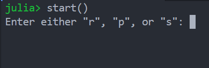
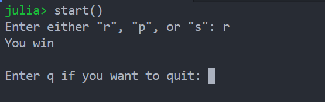

# rps.jl
A single-player rock-paper-scissors game using Julia.

The rules are simple: rock beats scissors, scissors beats paper, and paper beats rock.

## Starting the game
Run the `start()` function to start the game. The player will be prompted to enter either
"r", "p", or "s."

After the user enters their choice, it will be compared to the computer's randomly
generated move and a winner will be decided. 

If you want to stop playing, enter "q". If not, anything can be entered in this field.
